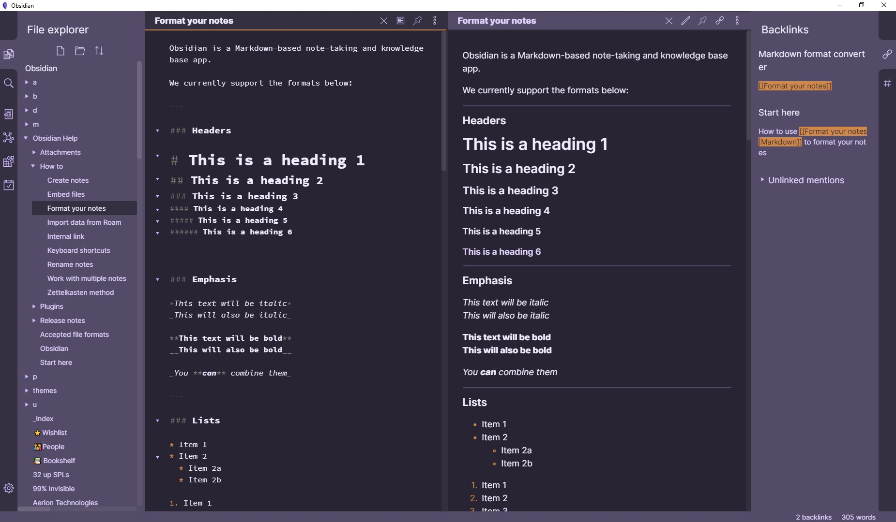

# Base2Tone-For-Obsidian.md
A theme for Obsidian based on http://base2t.one/ and http://simurai.com/duotone-dark-sky-syntax/

## Install
1. Download obsidian.css to your Obsidian vault folder.
2. In Obsidian, click Settings->Plugins and turn on "Custom CSS".
3. There is no step 3! Enjoy!

## Licence
I don't really care what happens to this theme, so I put it under [The Unlicense](./LICENSE) and set it free!
